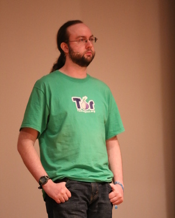
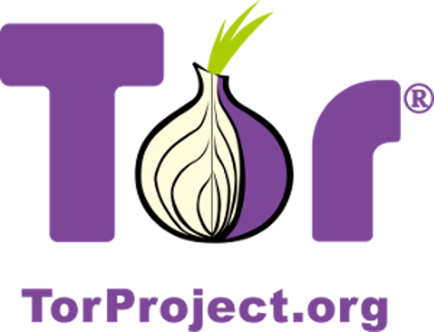
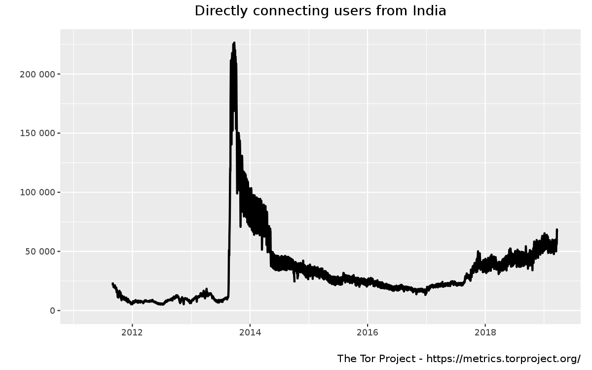
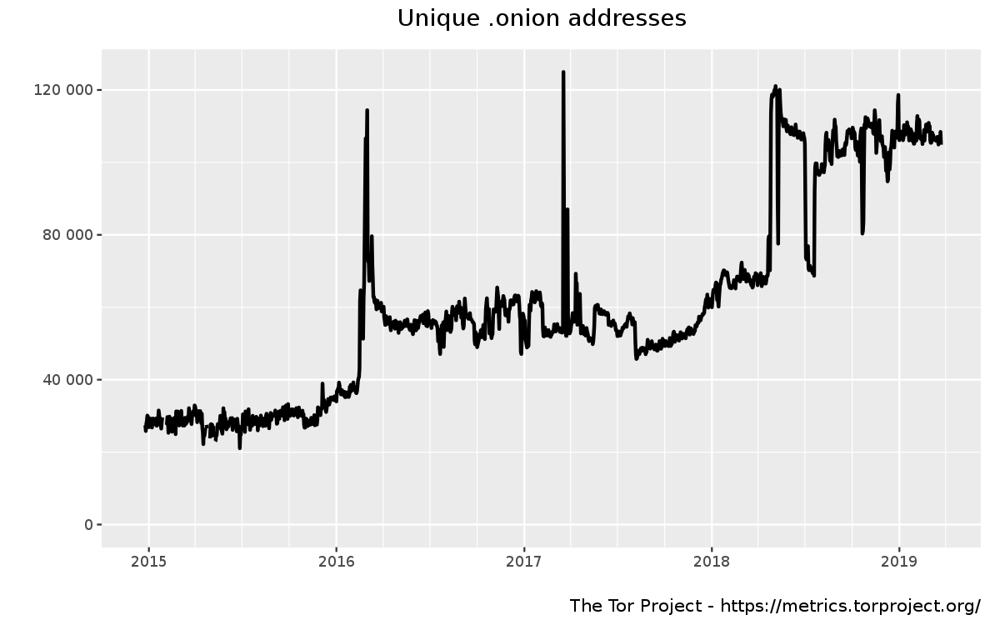
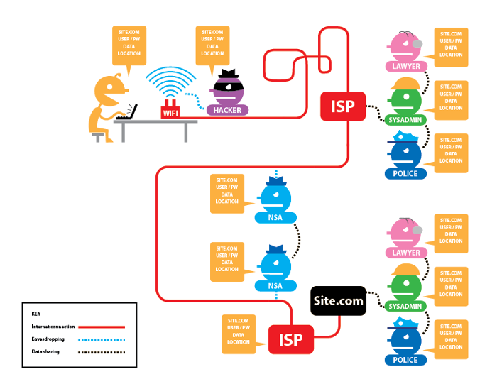
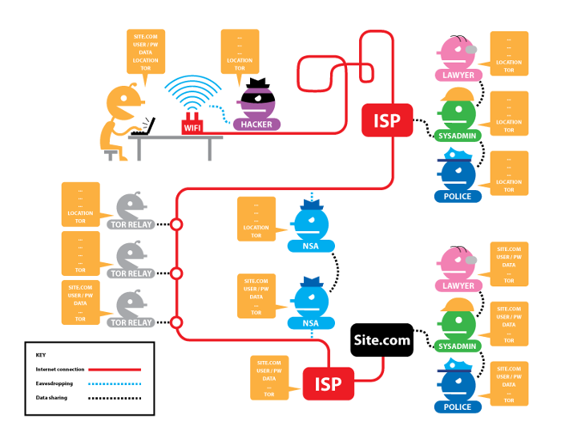
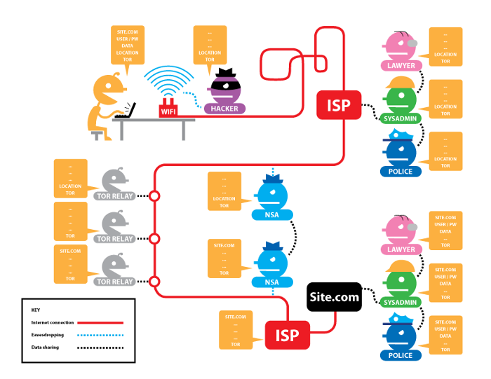
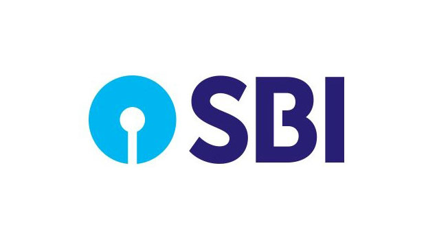

# Tor Under the Hood

---
## Speaker 👨

  .center[]

* ⚒️ Software Engineer

* 🌏 <http://blog.jaysinh.com>

* 💻 <http://github.com/ultimatecoder>

* 🐦 [@jaysinhp](https://twitter.com/jaysinhp)

* 📧 [jaysinhp@gmail.com](mailto:jaysinhp@gmail.com)

---
## 1990, United State Naval Research Laboratory

A branch of U.S. Navy

* Employees

  * David Goldschlag
  * Mike Reed
  * Paul Syverson

---
## 1997, The Defense Advanced Research Projects Agency (DARPA)

---
## 2000, The Onion Routing (TOR)

|  |  |
| ------------------------------------------------ | ------------------------------------------ |
| Roger Dingledine                                 | Paul Syverson                              |

---

## 2006, Tor project

---

## Users of Tor all around the world (last decase)

---

## User of Tor in India (last decade)

---

## Relay and Bridge operators in last decde

---

## Onion addresses in last decase

---

## Tor Relays

* Entry node (Guard node)

  * Remains for 2-3 months

  * Knows who is requesting

  * Doesn't know what is requested

* Middle node

  * Forwards request from Entry node to Exit node

  * Forwards response from Exit node to Entry node

  * Doesn't know who is requesting and what is responded

* Exit node

  * The one who actually resolves the request

  * Don't know who requested

  * Knows what is requested

* List of relays

---

## Diagram of Tor relays

---

## Bridge

* A special type of Tor relays that is not publicly listed

* Helps in connecting to Tor network if it is blocked by ISP or any level

* Bridges are geo distributed located

* It is difficult to get addresses of all the bridges

---

## Onion routing

* Client builds circuit first

* Generates three individual shared symmetric keys for all three relays in
  circuit.

---

## Onion routing

---

## Onion Service

* Location of the service is hidden yet accessible

* Domain of the service ends with ".onion"

* Dot onion services are only accessible via Tor network

* Requests is routed only through Tor relays

---

## No Tor No HTTPS

---

## No Tor Yes HTTPS

---

## Yes Tor No HTTPS

---

## Yes Tor Yes HTTPS

---

## Myths of Tor

---

## I am just watching YouTube videos. Should I use Tor?

---

## If I use Tor, I am not hackable

---

## I don't bother if someone is using my data because I am not doing anything illegal

---

## Tor is funded by U.S. Government. I am sure they knows hidden ways to crack Tor

---

## 

---

## Satyendra Dubey

## SBI Bank

