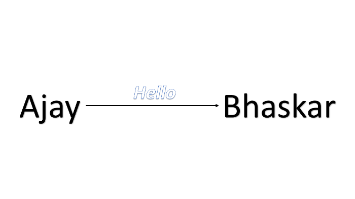
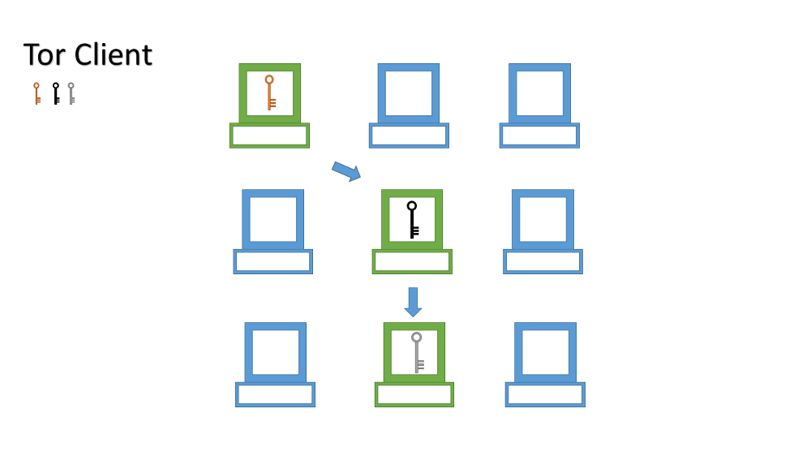
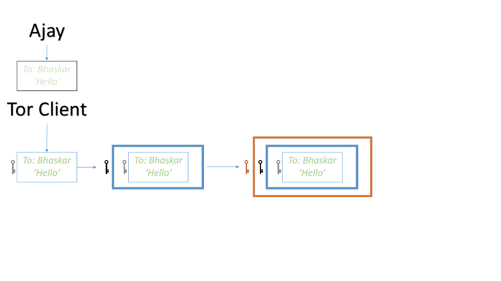
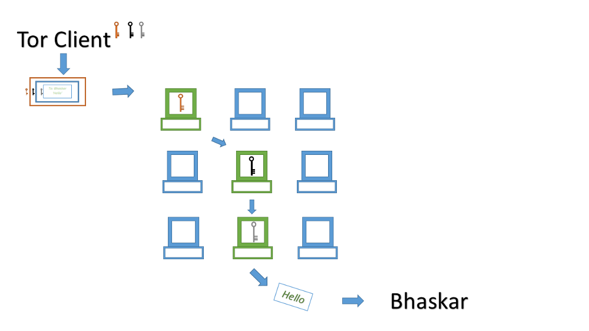

# Tor Under the Hood 🕵️

---
## Who am I? 👨

  .center[]

* ⚒️ Software Engineer

* 🌏 <http://blog.jaysinh.com>

* 💻 <http://github.com/ultimatecoder>

* 🐦 [@jaysinhp](https://twitter.com/jaysinhp)

* 📧 [jaysinhp@gmail.com](mailto:jaysinhp@gmail.com)

---

# Story 1

---

# Story 2

---

## Satyendra Dubey

.center[]

---

# Story 3

---

## SBI Bank

.center[]

---
## I know privacy, I use incognito mode! 😎

.center[]

---
## I know privacy, I use incognito mode! 😎

.center[]

---

## HTTP ❌ HTTPS ❌

---

## HTTP ❌ HTTPS ✔️

---

.center[]

---

.center[]

---

.center[]

---

# History 📚

---
## Year 1990, United State Naval Research Laboratory

.center[]

* Initial Employees
  * David Goldschlag
  * Mike Reed
  * Paul Syverson

---
## Year 1997, The Defense Advanced Research Projects Agency (DARPA)

.center[]

---
## Year 2000, The Onion Routing (TOR)

|   |  |
| ------------------------------------------------  | ------------------------------------------ |
| .center[Roger Dingledine]                         | .center[Paul Syverson]                     |

---
## Year 2006, Tor project

.center[]

---
# Statistics of last decade 📈

---

## Tor users - World 🌐

---
## Tor users - India 🇮🇳

---
## Relays and Bridges 👥

---

## Onion addresses 🗣️

---
# Components of Tor 🔮

---

## Tor Relays 🌀

* Entry node (Guard node)

  * Remains for 2-3 months

  * Knows who is requesting

  * Doesn't know what is requested

* Middle node

  * Forwards request from Entry node to Exit node

  * Forwards response from Exit node to Entry node

  * Doesn't know who is requesting and what is responded

* Exit node

  * The one who actually resolves the request

  * Don't know who requested

  * Knows what is requested

* List of relays are publicly available

---

## Diagram of Tor relays

.center[]

---

## Bridge 📡

* A special type of Tor relays that is not publicly listed

* Helps in connecting to Tor network if Tor is blocked by ISP or any level

* Bridges are GEO distributed

* It is difficult to get addresses of all the bridges

---

## Onion routing 🛡️

---

## Onion routing 🛡️

---

## Onion routing 🛡️

---

## Onion routing 🛡️

---

## Onion routing

---

## Onion Service

* Location of the service is hidden yet accessible

* Domain of the service ends with ".onion"

* Dot onion services are only accessible via Tor network

* Requests is routed only through Tor relays

---

## Tor ✔️ HTTPS ❌

---

## Tor ✔️ HTTPS ✔️

---

# Myths of Tor

---

# I don't bother if someone is using my data because I am not doing anything illegal

---

# Tor is mostly used by Hackers. I will get hacked If I use Tor

---

# I am watching YouTube videos. Still I should use Tor?

---

# Yes you should!

---

# Running a Tor relay invites a Police investigation

---

# If I use Tor, I am not hackable

---

# Tor is funded by U.S. Government. I am sure they knows hidden ways to crack Tor

---

# Tor or not Tor?
